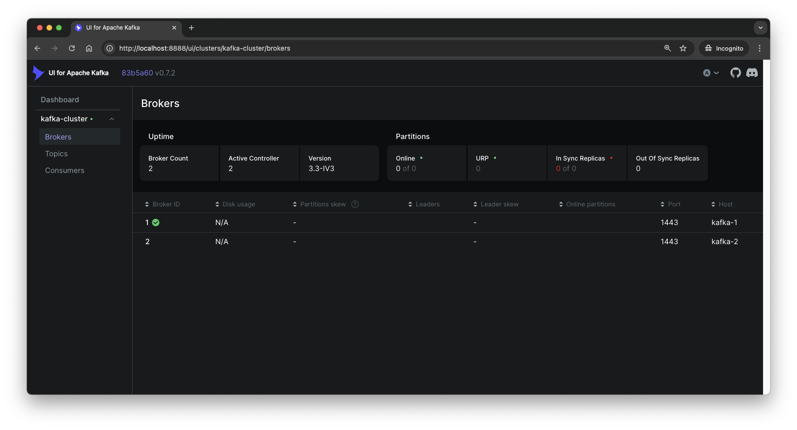

# Docker Kafka Cluster with SSL and KRaft mode

## Pre-requisites

Before you begin, ensure that you have the following installed on your system:

- **Docker**
- **Docker Compose**

## Quick Start

### 1. Generate certifications

First, you need to generate the certificates for the Kafka cluster. You can use the `generate-certs.yml` to generate the self-signed certificates.

Before running the command, you must set the following environment variables in the `.env` file. You can use the `env.example` file as a template:

```bash
$ cp env.example .env
```

Then, update the `.env` file with the appropriate values for your environment.

```bash
CNAME=mycompany.com.tw # default: example.com.tw
SAN=DNS:kafka-1,DNS:kafka-2,DNS:localhost # default: DNS:kafka-1,DNS:kafka-2,DNS:localhost
ORG_UNIT=IT Department # default: IT Department
ORG_NAME=My Company # default: Example
LOCALITY=Taipei # default: Taipei
STATE_OR_PROVINCE=Taiwan # default: Taiwan
COUNTRY_CODE=TW # default: TW
PASSWORD=p@ssw0rd # default: 123456
DAYS_VALID=90 # default: 365
```

> [!NOTE]
>
> - `CNAME`: The common name for the certificate.
> - `SAN`: The Subject Alternative Name for the certificate. You also can add IP addresses to the SAN (e.g. `IP:123.45.67.89`).
> - `ORG_UNIT`: The organizational unit for the certificate.
> - `ORG_NAME`: The organization name for the certificate.
> - `LOCALITY`: The locality for the certificate.
> - `STATE_OR_PROVINCE`: The state or province for the certificate.
> - `COUNTRY_CODE`: The country code for the certificate.
> - `PASSWORD`: The password for the keystore and truststore.
> - `DAYS_VALID`: The number of days the certificate is valid.

Once you have set the environment variables, you can generate the certificates by running the following command:

```bash
$ docker-compose -f gen-certs.yml up
```

The output should look like this:

```bash
[+] Running 2/0
 ✔ Network kafka-cluster_default  Created                                                                                                                                                        0.0s 
 ✔ Container gen-certs            Created                                                                                                                                                        0.0s 
Attaching to gen-certs
gen-certs  | ✅ Keytool found!
gen-certs  | ✅ OpenSSL found!
gen-certs  | Update OpenSSL...
gen-certs  | Get:1 http://ports.ubuntu.com/ubuntu-ports focal InRelease [265 kB]
gen-certs  | ...
gen-certs  | Get:18 http://ports.ubuntu.com/ubuntu-ports focal-security/multiverse arm64 Packages [5,924 B]
gen-certs  | Fetched 22.5 MB in 15s (1,490 kB/s)
gen-certs  | Reading package lists...
gen-certs  | Reading package lists...
gen-certs  | Building dependency tree...
gen-certs  | Reading state information...
gen-certs  | The following packages will be upgraded:
gen-certs  |   openssl
gen-certs  | 1 upgraded, 0 newly installed, 0 to remove and 13 not upgraded.
gen-certs  | Need to get 600 kB of archives.
gen-certs  | After this operation, 0 B of additional disk space will be used.
gen-certs  | Get:1 http://ports.ubuntu.com/ubuntu-ports focal-updates/main arm64 openssl arm64 1.1.1f-1ubuntu2.23 [600 kB]
gen-certs  | debconf: delaying package configuration, since apt-utils is not installed
gen-certs  | Fetched 600 kB in 2s (293 kB/s)
(Reading database ... 7382 files and directories currently installed.)
gen-certs  | Preparing to unpack .../openssl_1.1.1f-1ubuntu2.23_arm64.deb ...
gen-certs  | Unpacking openssl (1.1.1f-1ubuntu2.23) over (1.1.1f-1ubuntu2.22) ...
gen-certs  | Setting up openssl (1.1.1f-1ubuntu2.23) ...
gen-certs  | ✅ OpenSSL updated!
gen-certs  | ❶ Step 1: Initialize variables
gen-certs  | Directory (/certs) created!
gen-certs  | Generate credentials for Kafka...
gen-certs  | Credentials generated: /certs/kafka_keystore_creds, /certs/kafka_truststore_creds, /certs/kafka_ssl_key_creds
gen-certs  | Generate .env file...
gen-certs  | Environment file generated: (/config/.env)
gen-certs  | ❷ Step 2: Create CA
gen-certs  | Generating a RSA private key
gen-certs  | ...............................+++++
gen-certs  | ................................................................................................+++++
gen-certs  | writing new private key to '/certs/ca-key'
gen-certs  | -----
gen-certs  | ❸ Step 3: Import CA into truststore
gen-certs  | Certificate was added to keystore
gen-certs  | ❹ Step 4: Create keystore and generate key pair
gen-certs  | Generating 2,048 bit RSA key pair and self-signed certificate (SHA256withRSA) with a validity of 90 days
gen-certs  |    for: CN=mycompany.com.tw, OU=IT Department, O=My Company, L=Taipei, ST=Taiwan, C=TW
gen-certs  | ❺ Step 5: Create certificate signing request (CSR)
gen-certs  | ❻ Step 6: Sign the certificate
gen-certs  | Signature ok
gen-certs  | subject=C = TW, ST = Taiwan, L = Taipei, O = My Company, OU = IT Department, CN = mycompany.com.tw
gen-certs  | Getting CA Private Key
gen-certs  | ❼ Step 7: Import CA into keystore
gen-certs  | Certificate was added to keystore
gen-certs  | ❽ Step 8: Import signed certificate into keystore
gen-certs  | Certificate reply was installed in keystore
gen-certs  | 🎉 Successfully generated certificates for Kafka!
gen-certs exited with code 0
```

The script will generate the following files:

- `certs/ca-cert`
- `certs/ca-cert.srl`
- `certs/ca-key`
- `certs/kafka_keystore_creds`
- `certs/kafka_ssl_key_creds`
- `certs/kafka_truststore_creds`
- `certs/kafka-cluster-cert`
- `certs/kafka-cluster-cert-signed`
- `certs/kafka.keystore.jks`
- `certs/kafka.truststore.jks`
- `cofig/.env`

### 2. Start the Kafka cluster

Once the certificates are generated, you can start the Kafka cluster using Docker Compose:

```bash
$ docker-compose up -d
```

> [!NOTE]
> 
> This command will run the Kafka brokers in detached mode, allowing them to run in the background.

### 3. Done

You can now access the Kafka cluster via the web interface at [`http://localhost:8888`](http://localhost:8888). Use this interface to interact with your Kafka brokers, manage topics, and monitor cluster health.



### 4. Clean up

To stop the Kafka cluster, run the following command:

```bash
$ docker-compose down
```

## Configuration

### Enable Authentication for Web UI

To enable authentication for the web interface, you can update the `docker-compose.yml` file with the following environment variables:

```diff
services:

  kafka-ui:
    # ...
    environment:
      # ...
      # Basic Authentication for Web UI (https://docs.kafka-ui.provectus.io/configuration/authentication)
+     AUTH_TYPE: "LOGIN_FORM"
+     SPRING_SECURITY_USER_NAME: admin
+     SPRING_SECURITY_USER_PASSWORD: pass
```

> [!NOTE]
> 
> Please refer to the [Kafka UI documentation](https://docs.kafka-ui.provectus.io/configuration/authentication) for more information on configuring authentication.